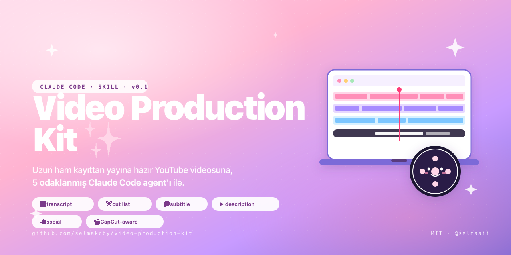

<p align="center">
  
</p>

# 🎬 Video Production Kit

> Claude Code için **video editleme + alt yazı + YouTube paketleme** skill'i. CapCut farkındalı, ffmpeg + Whisper tabanlı.

Uzun konuşma kayıtlarınız var. Bunları izlenebilir bir YouTube videosuna çevirmeniz gerekiyor: kesim, alt yazı, açıklama, X thread, bölüm zaman damgaları… Tek tek hepsini yapmak saatler alır. Bu kit, o işi **5 odaklanmış Claude Code agent**'ına dağıtır — her biri bir uzmanlık alanına bakar, birbirinin context'ini kirletmez.

```
              ┌──────────────────────┐
              │  Sen                 │
              │  "videom hazır"      │
              └──────────┬───────────┘
                         │
              ┌──────────▼───────────┐
              │  Ana Claude Code     │
              │  (orkestra şefi)     │
              └──┬───────────────────┘
                 │
   ┌─────────────┼─────────────┬──────────────┬──────────────┐
   ▼             ▼             ▼              ▼              ▼
┌────────┐  ┌─────────┐  ┌──────────┐  ┌─────────────┐  ┌──────────┐
│transc- │  │ cut-    │  │ subtitle │  │ description │  │  social  │
│ript    │  │ list    │  │          │  │             │  │          │
└────────┘  └─────────┘  └──────────┘  └─────────────┘  └──────────┘
```

---

## Ne yapıyor?

| Agent | Görevi |
|-------|--------|
| **transcript-agent** | CapCut timeline'ından / video dosyasından zaman damgalı Türkçe transkript (Whisper turbo) |
| **cut-list-agent** | Uzun ham kaydı → "şu saniyeden şu saniyeye sil" listesi (tekrar/dolgu/sapma temizliği) |
| **subtitle-agent** | Word-level zamanlı SRT, sözlük tabanlı yazım düzeltmesi (Cloud→Claude, Versal→Vercel vb.) |
| **description-agent** | Transkriptten YouTube açıklaması + bölüm zaman damgaları |
| **social-agent** | Aynı transkriptten X thread + Instagram caption |

Her agent kendi context'inde çalışır, birbirine müdahale etmez. Ana Claude orkestrasyon yapar.

---

## Hızlı kurulum (3 dakika)

```bash
# 1. Klonla
git clone https://github.com/selmakcby/video-production-kit.git
cd video-production-kit

# 2. Bağımlılıklar
pip install -r requirements.txt
brew install ffmpeg               # mac
# veya: apt install ffmpeg        # linux

# 3. Claude Code'da kullan
claude
```

Claude Code projeyi açtığında `.claude/agents/` altındaki agent'ları otomatik bulur.

---

## Hızlı kullanım

Claude Code içinde **doğal dilde** çağırırsın:

```
Sen: timeline 03'ün altyazısını çıkar
→ Claude subtitle-agent'ı çağırır → SRT üretir → Desktop'a yazar

Sen: bu videoma YouTube açıklaması yazar mısın
→ Claude description-agent'ı çağırır → bölümlerle birlikte verir

Sen: 21 dakikalık ham kaydı 5 dakikaya indirelim, kes listesi çıkar
→ Claude cut-list-agent'ı çağırır → CapCut'a uygulanabilir liste verir
```

Hiçbir CLI komutu ezberlemen gerekmiyor. Agent'lar arka planda doğru script'i çağırır.

---

## CapCut farkındalığı

Kit, CapCut Mac'in `draft_info.json` dosyasını parse edebilir. Yani:

- Hangi **timeline** üzerinde çalışıyorsun otomatik bulunur
- **Vol=0 muted segmentler** transkriptten çıkarılır (timing kaymaz)
- **Birden fazla track**'e dağılmış sesler timeline-doğru şekilde mix'lenir
- Çıkan SRT'nin saniyeleri **birebir CapCut timeline saniyeleri** olur

Detay: [`docs/capcut-integration.md`](docs/capcut-integration.md)

CapCut kullanmıyorsan da çalışır — sadece video dosyası verirsin.

---

## Klasör yapısı

```
video-production-kit/
├── README.md                    ← şu okuduğun
├── SKILL.md                     ← Claude Code skill manifest
├── .claude/agents/              ← 5 agent (Claude otomatik bulur)
│   ├── transcript-agent.md
│   ├── cut-list-agent.md
│   ├── subtitle-agent.md
│   ├── description-agent.md
│   └── social-agent.md
├── scripts/                     ← Python yardımcılar (ffmpeg + whisper)
│   ├── capcut_parser.py
│   ├── extract_audio.py
│   ├── transcribe.py
│   └── make_srt.py
├── prompts/                     ← şablonlar (agent'lar kullanır)
├── examples/                    ← canlı örnekler / case study
└── docs/                        ← derin teknik notlar
```

---

## Örnek: Bir MCP videosu üretim akışı

22 dakikalık ham kayıttan 7 dakikalık yayına hazır YouTube videosuna giden gerçek bir akış:

1. **transcript-agent** → ham kayıt transkripti
2. **cut-list-agent** → 21:05 → 5:00 için 14 kesim listesi
3. CapCut'ta kesimi uygula
4. **subtitle-agent** → SRT (timeline-doğru, sözlük düzeltmeli)
5. **description-agent** → YouTube açıklaması + bölümler
6. **social-agent** → X thread + IG caption

Toplam manuel iş: ~15 dakika. Tamamı el ile: ~3 saat.

[Tam case study →](examples/README.md)

---

## Gereksinimler

- macOS / Linux (Windows test edilmedi)
- Python 3.10+
- ffmpeg
- [Claude Code](https://code.claude.com)
- ~2 GB disk (Whisper turbo modeli ilk çalışmada indirilir)

---

## Katkı

PR'lara açık. Yeni agent ekleme, dil ekleme (şu an Türkçe + İngilizce optimize), DaVinci/Premiere parser eklemek için issue aç.

---

## Lisans

MIT — istediğin gibi kullan, dağıt, fork et.

---

## Yazar

[Selma Kocabıyık](https://github.com/selmakcby) · [@selmaaii](https://x.com/selmaaii) · [@selma.builds](https://www.instagram.com/selma.builds)

23 yaşında AI mühendisi. Claude Code, agent'lar ve LLM uygulamaları üzerine YouTube içeriği üretiyorum. Bu kit, kendi YouTube workflow'umdan doğdu.
